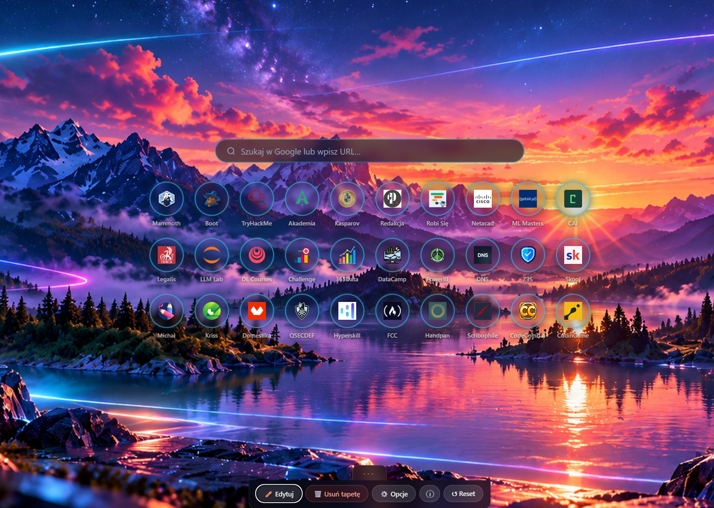

# SuperTab

**SuperTab** is a Chrome extension that replaces your new tab page with a clean, customizable bookmark grid.

## Features

- **30-tile bookmark grid** — up to 30 shortcuts displayed as icon tiles. Click to navigate, double-click to highlight with a colored border

- **Drag & drop reordering** — reorganize tiles in Edit mode

- **Custom icons** — upload your own PNG or ICO icon per bookmark

- **Wallpaper** — set any image as the background (stored locally, never uploaded anywhere)

- **Sticky note** — a quick-access note widget in the top-right corner, auto-saved

- **Google Search bar** — search or navigate directly from the new tab page

- **Themes** — choose between Default (light), Futuristic (dark neon) and Dark (minimal dark) from the Options popup. The theme is saved and synced across devices

- **Highlight color** — choose the color used for double-click tile markers

- **PL / EN language toggle** — switch the interface language at any time

- **Toolbar show/hide** — collapse the bottom toolbar when you don't need it

- **Reset to defaults** — restore the original 10 bookmarks

  

  ## ATENTION 

  Wallpapers should be less than 5MB and proper in size for a given screen resolution. For now the plugin doesn't crop by itself.

  

## Privacy

SuperTab works entirely locally. Your bookmarks, note and wallpaper are stored in `chrome.storage.sync` (bookmarks/options) or `localStorage` (wallpaper, note, preferences). Nothing is sent to any external server. The only external request is the Google favicon service (`www.google.com/s2/favicons`) used to fetch bookmark icons.

## Installation (developer mode)

1. Download or clone this repository
2. Open Chrome and go to `chrome://extensions`
3. Enable **Developer mode** (top right)
4. Click **Load unpacked** and select the `supertab-v3` folder
5. Open a new tab — SuperTab will appear immediately

## Security

SuperTab v3.1 was audited five times and includes the following protections:

**Input validation**
- Protocol whitelist for bookmark URLs (`https:` and `http:` only — blocks `javascript:`, `data:`, `vbscript:` and similar)
- Hex color validated with a strict regex before saving to storage (`/^#[0-9a-f]{6}$/i`)
- Language preference validated against an allowlist (`pl`, `en`) before use — prevents prototype pollution via `localStorage`
- Theme validated against an allowlist (`default`, `futuristic`, `dark`) on every read from storage and on every apply — arbitrary strings cannot be set as the `data-theme` attribute

**File and image handling**
- MIME type whitelist for custom tile icons: PNG, JPEG, WebP, GIF, ICO. SVG is explicitly blocked (can carry embedded `<script>`)
- The same MIME whitelist applies to wallpapers — checked both at file selection and after `FileReader` completes
- Extension double-check alongside MIME type on uploaded files
- Wallpaper data URI is stripped of quote characters before injection into a CSS `url()` value — prevents CSS injection via a crafted data URL

**Storage and DOM**
- All data read from `chrome.storage.sync` is sanitized through `sanitizeTile()` before use — storage is treated as untrusted
- Options are loaded field-by-field with explicit type and format checks, not via `Object.assign` — prevents unknown properties from being injected from storage
- Dynamic DOM content built exclusively with `createElement` / `textContent`. No `innerHTML` with user-supplied data anywhere in the codebase

**Network and policy**
- Strict Content Security Policy in `manifest.json`: `script-src 'self'`, no inline scripts, no `eval`, `connect-src 'none'`, `form-action 'none'`
- No external fonts, scripts, or stylesheets loaded at runtime — all CSS uses a system font stack so no `@import` requests are made from extension pages
- No telemetry, no analytics. The only outbound request is the Google favicon service used to fetch bookmark icons

## Usage

| Action | Result |
|--------|--------|
| Click tile | Open the bookmarked URL |
| Double-click tile | Toggle highlight border |
| Edit mode → click tile | Edit or delete bookmark |
| Edit mode → drag tile | Reorder tiles |
| `···` handle | Show / hide the toolbar |
| `+` tile | Add a new bookmark |
| Options → Theme | Switch between Default, Futuristic and Dark theme |

## License

Free to use and modify. If you redistribute a modified version, please credit the original author: **kozinek**.

Want to say thanks? [Buy me a coffee ☕](https://ko-fi.com/kozinek)
